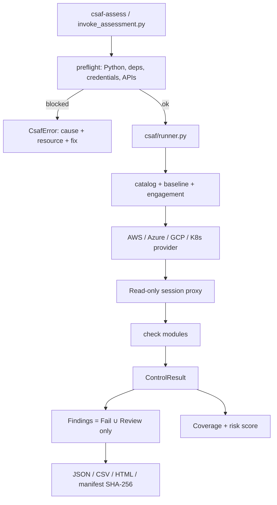

# Cloud Security Assessment Framework (CSAF)

CSAF is a **read-only** cloud security posture assessment framework. It
enumerates configuration, evaluates a declarative control catalog, records
exactly one status per selected control, and produces coverage, findings, and
executive/technical/remediation reports with a SHA-256 evidence inventory.

The installable distribution name is **`cloud-saf`**. The import package remains
`csaf`. Do **not** `pip install csaf` — that name is the OASIS Common Security
Advisory Framework on PyPI.

It does **not** create, modify, or delete cloud resources, and it does **not**
execute exploitation. A read-only guardrail blocks any mutating cloud API call
at runtime. Optional non-destructive validation (for example
`iam:SimulatePrincipalPolicy`-style policy analysis) is gated behind the
`Validation` authorization profile and an approving engagement file.

CSAF supports **AWS, Azure, GCP, and Kubernetes** end-to-end.

[](docs/test-execution/README.md)

> The offensive red-team methodology documents that seeded this project live
> under [`reference/`](reference/) and are **reference-only**. The directory
> also contains a standalone experimental aggregator; it is not packaged,
> imported, or executed by CSAF. CSAF itself is a defensive, read-only
> assessment tool.

## Table of contents

- [Windows Novice Usability Guide](docs/guides/WINDOWS_NOVICE_USABILITY_GUIDE.md) — start here if you are new to Windows
- [Linux Novice Usability Guide](docs/guides/LINUX_NOVICE_USABILITY_GUIDE.md) — start here if you are new to Linux
- [Five-minute quickstart](#five-minute-quickstart)
- [Guided live assessment](#guided-live-assessment)
- [Architecture](#architecture)
- [Authorization profiles](#authorization-profiles)
- [Exit codes](#exit-codes)
- [Control catalog](#control-catalog)
- [Troubleshooting](#troubleshooting)
- [FAQ](#faq)
- [CLI reference](#cli-reference)
- [Companion commands](#companion-commands)
- [Safety](#safety)
- [Testing](#testing)
- [Continuous integration](#continuous-integration)
- [Authorized use](#authorized-use)

## Five-minute quickstart

> **New to the terminal, Git, or Python? Start with the guide for your operating system: [Windows](docs/guides/WINDOWS_NOVICE_USABILITY_GUIDE.md) · [Linux](docs/guides/LINUX_NOVICE_USABILITY_GUIDE.md).**
> Each guide walks you from an unprepared computer to a verified first result, with troubleshooting, cleanup, and uninstall steps. Both assume no prior experience and start with the safe offline demo.

**Need:** Git, Python 3.10+, and network access once (to install locked dependencies). **No cloud account. No extra pip commands.**

```bash
git clone https://github.com/rikterskale/Cloud-Security-Assessment-Framework.git
cd Cloud-Security-Assessment-Framework

# Linux/macOS
python3 scripts/install.py
# Windows PowerShell
py -3 scripts\install.py
```

That is the entire first-run path. The installer creates `.venv`, installs `requirements-lock.txt` (hash-locked, every provider SDK included), bootstraps `pip` if needed, runs local preflight, and executes `--self-check`.

**Success:** installer exit `0`, and `out/*/executive-summary.html` exists. Expect `[INCOMPLETE]` inside the demo: one attestation control is intentionally untested, so the demo process exits `2` and the installer maps that to success.

Equivalent wrappers: `sh scripts/quickstart.sh` or `& .\scripts\quickstart.ps1`.

If the virtualenv already exists and you only want the demo:

```bash
python3 invoke_assessment.py --self-check --output-dir out
```

Expect `[INCOMPLETE]` and exit code `2` — that is success for the demo (one control is intentionally left untested).

### Published installers (v1.1.0)

After the GitHub Release for tag `v1.1.0` succeeds:

```bash
pipx install cloud-saf==1.1.0
# or
docker pull ghcr.io/rikterskale/cloud-saf:1.1.0
docker run --rm --read-only --cap-drop ALL --tmpfs /tmp \
  --user "$(id -u):$(id -g)" -v "${PWD}/out:/work/out" \
  ghcr.io/rikterskale/cloud-saf:1.1.0 --self-check --output-dir /work/out
```

From a source checkout, `python3 scripts/install.py` (Windows: `py -3 scripts\install.py`) still works with no extra pip commands.

Homebrew (`Formula/cloud-saf.rb`) can install from the tagged tarball once the GitHub Release exists; until a bottle is published, `brew install --HEAD Formula/cloud-saf.rb` remains the source path.

## Guided live assessment

Print a complete, copy-paste playbook for the cloud you will assess. It covers
the CLI to install, the read-only identity to create, how to prove login works,
the CSAF commands, and how to read the reports. **No cloud calls.**

```bash
csaf-assess --guide --cloud aws
csaf-assess --guide --cloud azure
csaf-assess --guide --cloud gcp
csaf-assess --guide --cloud k8s
```

Then follow the printed steps. The short version after the playbook is:

1. Create a **read-only** identity (AWS `SecurityAudit`, Azure Reader + Security Reader, GCP `roles/viewer`, Kubernetes `view`).
2. Prove login: `aws sts get-caller-identity` / `az account show` / `gcloud projects describe` / `kubectl get ns`.
3. `csaf-assess --preflight --live --cloud ...` — every failure includes the exact next command.
4. Run the scan command the preflight prints.
5. Open `out/*/executive-summary.html`, then `findings.csv` (CRITICAL first), then `coverage-report.csv`.

### Assess a real environment

Only after `--guide` and a passing `--preflight --live`:

**AWS** — IAM user/role with the managed `SecurityAudit` policy (never root, never AdministratorAccess):

```bash
csaf-assess --preflight --live --cloud aws --aws-profile csaf-audit
csaf-assess --cloud aws --aws-profile csaf-audit --regions us-east-1 --output-dir out
```

**Azure** — `az login`, then Reader + Security Reader on the subscription:

```bash
csaf-assess --preflight --live --cloud azure --subscription SUBSCRIPTION_ID
csaf-assess --cloud azure --subscription SUBSCRIPTION_ID --output-dir out
```

**GCP** — `gcloud auth application-default login` and `roles/viewer` on the project:

```bash
csaf-assess --preflight --live --cloud gcp --project PROJECT_ID
csaf-assess --cloud gcp --project PROJECT_ID --output-dir out
```

**Kubernetes** — kubeconfig context with the built-in `view` ClusterRole (not cluster-admin):

```bash
csaf-assess --preflight --live --cloud k8s --kube-context CONTEXT_NAME
csaf-assess --cloud k8s --kube-context CONTEXT_NAME --output-dir out
```

Then open `out/*/executive-summary.html` and `out/*/findings.csv` (CRITICAL first).
Confirm coverage in `out/*/coverage-report.csv` — empty findings do not mean a complete assessment.

## Architecture



```text
invoke_assessment.py (CLI)
        │  argparse -> RunConfig
        ▼
csaf/runner.py (orchestration + exit-code policy)
        │
        ├─ catalog.py / baseline.py / engagement.py
        ├─ selfcheck.py  (offline)  — or —  clouds/<cloud>/provider.py
        │       ▼
        │  clouds/base.py AssessmentModule.evaluate()
        │       any exception -> one Error result (never a pass)
        ▼
model.py / coverage.py / compliance.py / reporting.py / evidence.py
```

Design invariants, pinned by tests:

- **One status per selected control** — `Pass`, `Fail`, `Review`, `NotApplicable`, `NotTested`, or `Error`.
- **Execution errors are not security passes.** `NotTested` and `Error` never produce a finding.
- **Findings are a strict subset of control results**, derived only from `Fail` and `Review`.
- **Coverage is tracked separately from findings.**

## Authorization profiles

| Profile | Read-only | Extra behaviour | Authorization |
|---|---|---|---|
| `Inventory` | yes | Same collection as Assessment; writes control results without issuing findings | None |
| `Assessment` | yes | Default posture assessment | None |
| `Validation` | yes | Adds non-destructive policy validation controls | Signed, in-window, scoped engagement |
| `AdversarySimulation` | yes | Validation set filtered to MITRE-mapped controls | Same as Validation |

Validation-only controls (marked `validationOnly` in the catalog) are excluded
from `Inventory` and `Assessment` selections.

## Exit codes

- `0` — all selected controls executed, no execution errors.
- `2` — completed, but one or more selected controls were `NotTested` or errored.
- `1` — fatal runner or prerequisite failure.

## Control catalog

Each control maps to CIS Foundations, NIST SP 800-53, NIST CSF 2.0, SOC 2 TSC,
the relevant Well-Architected pillar, and/or MITRE ATT&CK.

AWS `CIS-AWS:*` IDs follow CIS Foundations **v5.0.0**. Azure 6.0 / GCP 5.0 / Kubernetes 1.11
IDs are the labeled baseline versions; treat any remaining older-edition numbers as a known gap.

### AWS — 33 controls ([`control-catalog.json`](controls/control-catalog.json))

Identity, S3, EC2, network, CloudTrail/Config/GuardDuty/Security Hub, KMS, RDS, Secrets Manager, operations attestation. Default baseline: `baselines/aws-cis-5.0.json`.

### Azure — 17 controls ([`control-catalog-azure.json`](controls/control-catalog-azure.json))

Privileged access, Defender for Cloud, storage, NSG, VMs, logging, SQL, Key Vault. Default baseline: `baselines/azure-cis-6.0.json`.

### GCP — 19 controls ([`control-catalog-gcp.json`](controls/control-catalog-gcp.json))

IAM, storage, network, compute, logging, KMS, Cloud SQL. Default baseline: `baselines/gcp-cis-5.0.json`.

### Kubernetes — 14 controls ([`control-catalog-k8s.json`](controls/control-catalog-k8s.json))

RBAC (cluster-admin and wildcard roles), pod security (privileged, hostNetwork/PID/IPC, hostPath, privilege escalation), default SA token automount, NetworkPolicy, plus operator attestations. Default baseline: `baselines/k8s-cis-1.11.json`.

## Troubleshooting

| Symptom | Cause | Fix |
|---|---|---|
| `python` / `py` not found | Python not on PATH | Install Python 3.10+ |
| `[CSAF-E001]` missing module | extra not installed | `python -m pip install 'cloud-saf[aws]'` (or azure/gcp/k8s) |
| `[CSAF-E002]` credentials | no usable identity | `csaf-assess --guide --cloud aws` (or azure/gcp/k8s), then the login command it prints |
| `[CSAF-E004]` AccessDenied | identity cannot read an API | Attach AWS `SecurityAudit` (or Azure Reader + Security Reader / GCP `roles/viewer`) |
| `[INCOMPLETE]` / exit 2 on `--self-check` | demo leaves one control untested | None — this is success |
| `Fatal: Unauthorized profile` | Validation without a signed engagement | Use `--profile Assessment`, or sign an engagement |
| `pip install csaf` is the wrong tool | PyPI name collision | `pipx install cloud-saf==1.1.0` or `python scripts/install.py` |
| `pipx install cloud-saf` 404 | Release workflow has not published yet | Use `python scripts/install.py`, then retry `pipx install cloud-saf==1.1.0` |

Need a traceback? Re-run with `--log-level DEBUG`.

## FAQ

**Do I need cloud credentials to try this?**
No. `python scripts/install.py` uses synthetic data for the first run.

**Will this change my account?**
No. Mutating verbs are blocked in process.

**Can I `pip install csaf` from PyPI?**
Not this project. The distribution name is `cloud-saf`. Install with `pipx install cloud-saf==1.1.0`.

**Is there a tagged release?**
Yes. Tag `v1.1.0` is the first GitHub Release. See [docs/RELEASE_PROCESS.md](docs/RELEASE_PROCESS.md).

**What is `authorizedSourceAddresses`?**
An engagement field this local tool cannot prove, so an active run containing this restriction **fails closed**. Enforce the restriction outside CSAF or omit the field.

## CLI reference

See the generated [CLI reference](docs/CLI_REFERENCE.md) for the complete
option surface. Summary:

| Flag | Default | Purpose |
|---|---|---|
| `--cloud` | `aws` | Cloud provider (`aws`, `azure`, `gcp`, `k8s`) |
| `--profile` | `Assessment` | `Inventory`, `Assessment`, `Validation`, `AdversarySimulation` |
| `--regions` | `us-east-1` | AWS regions (space-separated) |
| `--catalog` | packaged | Control catalog path |
| `--baseline` | packaged CIS baseline | Threshold/override baseline path |
| `--engagement` | none | Signed engagement file |
| `--engagement-key-file` | none | HMAC key for the engagement |
| `--allow-secret-discovery` | off | Azure Validation secret-location inventory |
| `--previous-findings` | none | Prior `findings.json` for delta |
| `--aws-profile` | none | Named AWS credentials profile |
| `--subscription` | discovered | Azure subscription ID |
| `--subscriptions` | none | Azure: several subscriptions, then aggregate |
| `--project` | ADC default | GCP project ID |
| `--projects` | none | GCP: several projects, then aggregate |
| `--accounts` | none | AWS expected account ID |
| `--kube-context` | current-context | Kubernetes context |
| `--kubeconfig` | standard | Kubeconfig path |
| `--max-workers` | `1` | AWS region concurrency |
| `--output-dir` | `csaf-output` | Parent directory for run subdirs |
| `--export` | none | `sarif` and/or `oscal` |
| `--attest-key-file` | none | Sign `attestation.json` |
| `--log-level` | `INFO` | `DEBUG`, `INFO`, `WARN`, `ERROR` |
| `--check-only` | off | Authorize profile/scope/catalog, no cloud |
| `--self-check` | off | Offline synthetic run |
| `--preflight` | off | Local (and with `--live`, cloud) prerequisite check |
| `--live` | off | Probe credentials/API access with `--preflight` |
| `--skip-live-preflight` | off | Skip automatic live probe on real assessments |
| `--plan` | off | No-network control preview |
| `--tutorial` | off | Offline fixture tutorial |
| `--cleanup-tutorial` | off | Remove tutorial output |
| `--no-color` | off | Plain terminal output |
| `--color` | off | Force ANSI color |
| `--completion` | none | Print bash/zsh/powershell completion |
| `--output-format` | `text` | `text` or `json` for preflight/plan |
| `--guide` | off | Print a step-by-step live-assessment playbook for `--cloud` |
| `--explain` | none | Offline control explorer |
| `--help` | off | Show help |
| `--version` | off | Show `CSAF v<version>` |

## Companion commands

Besides `csaf-assess` / `cloud-saf` and `csaf-sign-engagement`, the package installs focused
helper commands. They operate on local files by default. `csaf-campaign run` can contact the selected
cloud unless its campaign was created with
`--self-check`; `csaf-attest external-sign` delegates to the explicitly invoked
Cosign executable; and `csaf-drift --webhook-url` sends an explicitly configured
webhook request:

For arguments, output locations, and exit behavior, see the
[companion command reference](docs/COMPANION_COMMANDS.md).

| Command | Purpose |
|---|---|
| `csaf-campaign` | Create, sign, verify, or run a replayable assessment **campaign** (reproducible runs). A campaign `targets` list assesses several clouds/scopes and writes an org aggregate. |
| `csaf-attest` | Sign (`sign`) and verify (`verify`) an **attested evidence bundle** over a run's manifest |
| `csaf-drift` | Compare two runs' `findings.json`, write optional time-series history, and send opt-in HMAC/Bearer-authenticated SIEM alerts |
| `csaf-aggregate` | Roll several run directories into one **org-wide** report with cross-scope control failures |
| `csaf-detection-pack` | Build a **purple-team** detection-coverage pack (benign, defender-focused validation markers) |
| `csaf-attack-path` | Read-only IAM **privilege-escalation path** analysis over a provided IAM snapshot |
| `csaf-lint-catalog` | Validate a control catalog (schema + module/check resolution) |
| `csaf-new-module` | Print a new assessment-module scaffold + catalog stub |

## Output artifacts

Each run writes a unique subdirectory under `--output-dir`:

`findings.json` / `findings.csv`, `executive-summary.html`, `technical-report.json`,
`coverage-report.csv`, `remediation-roadmap.csv`, `control-results.jsonl`,
`manifest.json`, `assessment-<ts>.log`, `evidence/`.

## Safety

- Read-only proxies: AWS `ReadOnlyClient`, Azure GET-only `ArmSession`, GCP GET + read-only POST allow-list, Kubernetes `list_*`/`read_*` only (`connect_*` blocked). `sts:AssumeRole` remains blocked.
- Engagement scope, window, and HMAC signature for active profiles.
- HTML reports escape untrusted values.

## Testing

```bash
python3 -m unittest discover -s tests -v
python3 -m coverage run --source=csaf,invoke_assessment -m unittest discover -s tests
python3 -m coverage report --fail-under=90
```

## Continuous integration

`.github/workflows/ci.yml` runs Ruff (including UP/RUF), mypy, `tools/sync_resources.py --check`,
actionlint, shellcheck, pip-audit, CodeQL, CycloneDX SBOM, Python 3.10–3.14, Windows/macOS,
wheel/sdist smoke, 90% coverage.

`.github/workflows/release.yml` attests artifacts, publishes a GitHub Release, publishes
`cloud-saf` to PyPI (Trusted Publishing), and pushes `ghcr.io/rikterskale/cloud-saf:<version>`.
Tag `v1.1.0` is the first release cut from that workflow.

## Extending to other clouds

Add a provider under `csaf/clouds/<cloud>/`, a catalog and baseline, and register it in
`csaf/runner.py`'s `CLOUDS` table. See [CONTRIBUTING.md](CONTRIBUTING.md).

## Authorized use

CSAF is for authorized security assessments only. Run it against accounts,
subscriptions, projects, or clusters you own or are explicitly authorized to
assess, using least-privilege read-only credentials, and protect the output
directory.

License: MIT. See [LICENSE](LICENSE).
